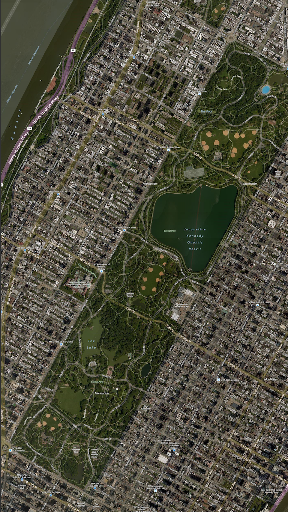

# EECS 395 Assignment #3
### Aerial/Satellite Imagery Retrieval
### Andres Kim, YaNing Wang, Stacy Montgomery

## Directory Structure
```
├── script.py
├── empty_image.png
├── README.md
└── example_outputs
  └── oracle.png
  └── square.png
  └── park.png

```

## Setup
This script is run with Python 3.

## Running the Script
Make sure you have a coordinates and the number of tile differences to test the script. The larger the tile differences, the larger and higher resolution the image will be. The default will be 5.
```
python3 script.py [lat1] [lon1] [lat2] [lon2] [tile_diff]
```
We also have provided some examples below:
```
python3 script.py 37.753051 -122.205149 37.748436 -122.197253
```

```
python3 script.py 45.434522 12.337127 45.433657 12.339620 2
```

```
python3 script.py 40.803605 -73.982370 40.762912 -73.952167
```


The script will output and show the final high-resolution image for the coordinates given. We have provided a way for the user to specify the number of tile differences so that larger bounding boxes do not exactly result in extremely large images. Imagine if we input a coordinates box of the whole Illinois state and seek the highest resolution by stitching all tile images in the lowest level, the output will be a insanely big image, which may not be what we want. By letting the user specify tile differences, user can request output size catering to its need. For example, the default 5 tile difference will always generate a image close to the size of 1280 by 1280.

Note: Sometimes the image cannot be retrieved at a certain point in time from the server (url retrieval timeout). Please just re-run the code and it should work.
